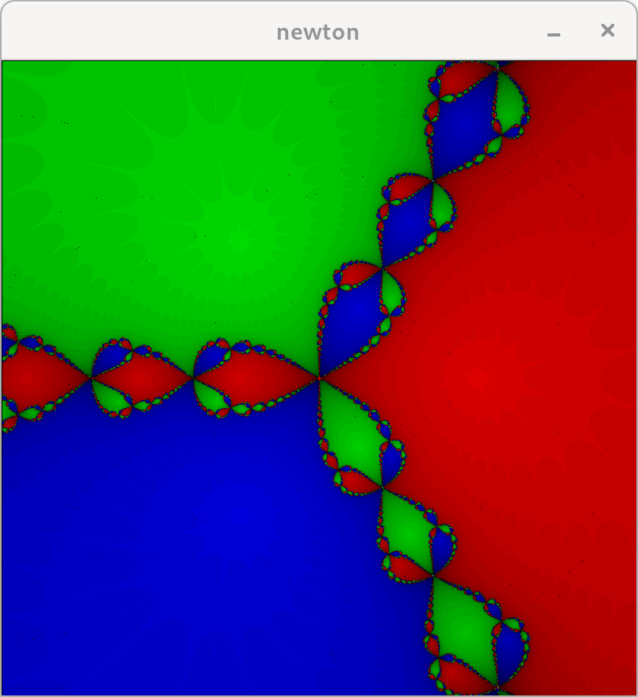

# Fractol

## Descripción

Este proyecto es parte del cursus 42 y se llama **fractol**. El objetivo es explorar fractales matemáticos a través de una interfaz gráfica. Para ello se utiliza la libreria minilibx. En el proyecto se han trabajado 3 conocidos fractales: el conjunto de Mandelbrot, el conjunto de Julia y el fractal de Newton.

## Fractales. Mapas logísticos o ecuaciones iterativas.

_Un fractal es un objeto geométrico cuya estructura básica, fragmentada o aparentemente irregular, se repite a diferentes escalas._ [(Wikipedia)](https://es.wikipedia.org/wiki/Fractal). Los fractales son generados por resultados de mapas lógisticos o funciones iterativas, analizando la convergencia de la dínamica de las mismas en cada punto del plano complejo. 

### Conjunto de Mandelbrot

El conjunto de Mandelbrot es un conjunto de números complejos $(a + bi)$ definido por una iteración particular de una función cuadrática. Un número complejo $c$ pertenece al conjunto de Mandelbrot si, al iterar la función 

$$ f_c(z) = z^2 + c $$

partiendo de $(z = 0)$, la magnitud de $z$ no se vuelve infinita. En otras palabras, el conjunto de Mandelbrot está definido como el conjunto de números complejos $c$ para los cuales la sucesión dada con $(z_0 = 0)$, permanece acotada en magnitud.

### Conjunto de Julia

El conjunto de Julia es un conjunto de números complejos que se genera mediante la iteración de una función cuadrática similar a la utilizada para el conjunto de Mandelbrot. Sin embargo, en este caso, la constante ( c ) es fija y cada punto ( z ) en el plano complejo se analiza para determinar si pertenece al conjunto de Julia. La función iterativa es:

$$\ f_c(z) = z^2 + c $$

Un número complejo \( z \) pertenece al conjunto de Julia para un valor dado de ( c ) si, al iterar la función comenzando con ( z ), la magnitud de ( z ) no se vuelve infinita. En términos formales, el conjunto de Julia para un número complejo dado ( c ) está definido como el conjunto de puntos ( z ) para los cuales la sucesión dada permanece acotada en magnitud. Se debe introducir al programa la parte real y la imaginaria de un número complejo para que dibuje la correspondiente imagen. Despues, el programa cambia dinamicamente el conjunto en función de la posición del ratón que representa un punto en el plano complejo.

### Fractal de Newton

El fractal de Newton es un fractal que se genera mediante la aplicación del método de Newton para encontrar las raíces de una función compleja. Este método utiliza la iteración de la fórmula de Newton-Raphson:

$$ z_{n+1} = z_n - \frac{f(z_n)}{f'(z_n)} $$

donde $f(z)$ es una función analítica y $f'(z)$ es su derivada. Para un polinomio dado, como $f(z) = a*z^3 - b$, las raíces son los puntos en los que la función se anula. El fractal de Newton se forma asignando colores a los puntos del plano complejo dependiendo de a cuál raíz convergen cuando se aplica repetidamente el método de Newton. En resumen, el fractal de Newton para una función $f(z)$ se obtiene iterando la formual de Newton-Raphson y coloreando cada punto $z_0$ según la raíz a la que converge. Como la función es cúbica tiene 3 raices. Sin el `modo tricolor` se dibuja cada punto en función de la velocidad de convergencia. Con el `modo tricolor` activado se pueden ver las convergencias a cada una de las 3 raices.


## Compilación y ejecución

Para compilar el programa `fractol`, que incluye los conjuntos de Mandelbrot y Julia, usa el siguiente comando:

```sh
make
```
Para compilar el programa `fractol_bonus`, que incluye el fractal de Newton, usa el siguiente comando:

```sh
make bonus
```

Si realizas cambios en `fractol.h`, recompila el proyecto con:

```sh
make re
```
Para borrar los objetos y el ejecutable:

```sh
make fclean
```
Para ver la forma correcta de introducir los argumentos al programa y ejecutar satisfactoriamente, 
**ejecutar el mismo programa sin argumentos. El programa devuelve un mesaje con las indicaciones.**


## Controles

- **ESC** o cerrar la ventana:      Finaliza el programa.
- **Flechas del teclado**:          Mueve la imagen en traslación.
- **Teclas + / -**:                 Realiza zoom central de la imagen.
- **Scroll del ratón**:             Realiza zoom en la dirección donde apunta el ratón.
- **Tecla p**:                      Aumenta precisión de la imagen.
- **Tecla m**:                      Disminuye la precisión de la imagen.
- **Delete**:                       Reset al zoom y precisión iniciales.
- **Tecla l**:                      Colores con interpolación lineal.
- **Tecla b**:                      Colores con interpolación de Bezier.
- **Tecla t**:                      Activa / desactiva el modo tricolor (solo en el fractal de Newton).

## Notas

- Cambiando la precisión cambia la gama de colores
- La interpolación de Bezier es probable que tenga una velocidad de renderizado lenta y por lo tanto una experiencia de usuario no muy suave.
- Aumentar la precisión de la imagen disminuye la velocidad de renderizado y viceversa.
- Sin el modo tricolor solo se aprecia el comportamiento de convergencia y activando el modo tricolor es posible ver la convergencia a cada raíz compleja.

## Imagenes





